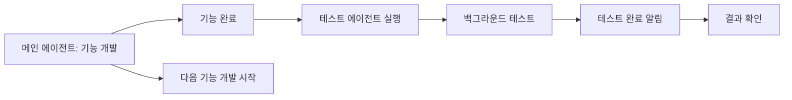

# E2E Test Agent Template

이 템플릿을 사용하여 어떤 기능에 대해서든 자동으로 E2E 테스트를 작성하고 실행할 수 있습니다.

## 사용 방법

### 1. 기본 사용법

```
Task(
  subagent_type: "general-purpose",
  description: "E2E 테스트 작성 및 실행",
  run_in_background: true,
  prompt: """
  당신은 E2E 테스트 전문 에이전트입니다.

  ## 목표
  HeistHunt 프로젝트의 "[기능명]" 기능에 대한 E2E 테스트를 작성하고 실행하세요.

  **중요: Android와 iOS 모두 테스트해야 합니다.**

  ## 작업 단계

  ### 1. 코드 분석
  - 관련 파일 읽기: [파일 경로들]
  - 주요 기능 파악
  - 사용자 인터랙션 포인트 식별

  ### 2. 테스트 시나리오 작성
  기존 테스트를 참고하여 다음 시나리오 작성:
  - [시나리오 1]
  - [시나리오 2]
  - [시나리오 3]

  ### 3. 테스트 코드 작성

  #### Android 테스트
  - **파일**: `composeApp/src/androidTest/kotlin/com/heisthunt/app/scenarios/[기능명]FlowTest.kt`
  - **참고**: LoginFlowTest.kt 스타일 따르기
  - **프레임워크**: JUnit4 + Compose UI Test
  - Mock 활용
  - 최소 5개 이상의 시나리오 작성

  #### iOS 테스트
  - **파일**: `iosApp/iosAppUITests/[기능명]FlowUITests.swift`
  - **참고**: LoginFlowUITests.swift 스타일 따르기 (있는 경우)
  - **프레임워크**: XCTest + XCUITest
  - Mock 활용
  - Android와 동일한 시나리오 작성

  ### 4. 테스트 실행

  #### Android 테스트 실행
  ```bash
  ./gradlew :composeApp:connectedDebugAndroidTest
  ```

  #### iOS 테스트 실행
  ```bash
  xcodebuild test \
    -workspace iosApp/iosApp.xcworkspace \
    -scheme iosApp \
    -destination 'platform=iOS Simulator,name=iPhone 17 Pro'
  ```

  ### 5. 결과 리포트
  **Android 결과:**
  - 총 테스트 개수
  - 성공/실패 개수
  - 실패한 테스트 상세
  - 발견된 버그/개선사항

  **iOS 결과:**
  - 총 테스트 개수
  - 성공/실패 개수
  - 실패한 테스트 상세
  - 발견된 버그/개선사항

  **통합 리포트:**
  - 양쪽 플랫폼 결과 비교
  - 플랫폼별 차이점
  - 공통 이슈

  ## 참고 사항
  - Android: LoginFlowTest.kt 구조 따르기
  - iOS: XCTest 베스트 프랙티스 따르기
  - Mock 활용으로 외부 의존성 제거
  - 실제 사용자 플로우 시뮬레이션
  - 독립적 테스트 작성
  - **양쪽 플랫폼에서 동일한 시나리오 검증**

  ## 제약사항
  - 실제 Firebase/네트워크 호출 금지
  - 기존 코드 수정 금지
  - **Android와 iOS 모두 테스트 작성 필수**

  작업을 시작하세요!
  """
)
```

---

## 실제 예시

### 예시 1: 게임 생성 화면 테스트

```kotlin
Task(
  subagent_type: "general-purpose",
  description: "게임 생성 화면 E2E 테스트",
  run_in_background: true,
  prompt: """
  당신은 E2E 테스트 전문 에이전트입니다.

  ## 목표
  HeistHunt의 "게임 생성 화면" 기능에 대한 E2E 테스트 작성 및 실행

  ## 작업 단계

  ### 1. 코드 분석
  - CreateGameScreen.kt 읽기
  - 게임 생성 플로우 파악

  ### 2. 테스트 시나리오
  - 정상 게임 생성 플로우
  - 빈 이름으로 생성 시도 (검증)
  - 설정 변경 후 생성
  - QR 코드 생성 확인
  - 방 정보 표시 확인

  ### 3. 테스트 코드 작성
  - 파일: CreateGameFlowTest.kt
  - LoginFlowTest.kt 스타일 참고

  ### 4. 테스트 실행 및 리포트

  작업 시작!
  """
)
```

### 예시 2: QR 스캔 기능 테스트

```kotlin
Task(
  subagent_type: "general-purpose",
  description: "QR 스캔 기능 E2E 테스트",
  run_in_background: true,
  prompt: """
  E2E 테스트 전문 에이전트 작업:

  목표: QR 코드 스캔 기능 테스트

  시나리오:
  - 카메라 권한 요청
  - QR 스캔 화면 표시
  - 유효한 QR 코드 스캔 (Mock)
  - 잘못된 QR 코드 스캔
  - 스캔 후 방 참여

  파일: QRScanFlowTest.kt
  참고: LoginFlowTest.kt
  """
)
```

---

## 작업 흐름



---

## 에이전트 출력 확인

### 진행 중 확인
```bash
tail -f /private/tmp/claude-501/.../tasks/[agent-id].output
```

### 완료 후 확인
- 자동으로 알림이 옴
- 테스트 리포트 확인
- 생성된 테스트 코드 검토

---

## 베스트 프랙티스

### ✅ DO
- 명확한 시나리오 정의
- Mock을 적극 활용
- 기존 테스트 스타일 유지
- 독립적인 테스트 작성
- 에러 케이스 포함

### ❌ DON'T
- 실제 네트워크 호출
- 기존 프로덕션 코드 수정
- 다른 테스트에 의존
- 하드코딩된 타이밍 의존

---

## 에이전트 결과물

테스트 에이전트가 완료하면:
1. ✅ 테스트 코드 파일 생성
2. ✅ 테스트 실행 결과
3. ✅ 성공/실패 리포트
4. ✅ 발견된 이슈 목록
5. ✅ 개선 제안 사항

---

## 확장 가능성

### iOS 테스트 추가
```swift
// iOS XCUITest도 동일한 방식으로 작성 가능
// 템플릿에 iOS 경로 추가
```

### 통합 테스트
```kotlin
// 여러 화면을 연결한 통합 테스트
// 로그인 → 게임 생성 → 게임 참여 → 게임 플레이
```

### 성능 테스트
```kotlin
// 로딩 시간, 메모리 사용량 등
// measure { } 블록 활용
```
